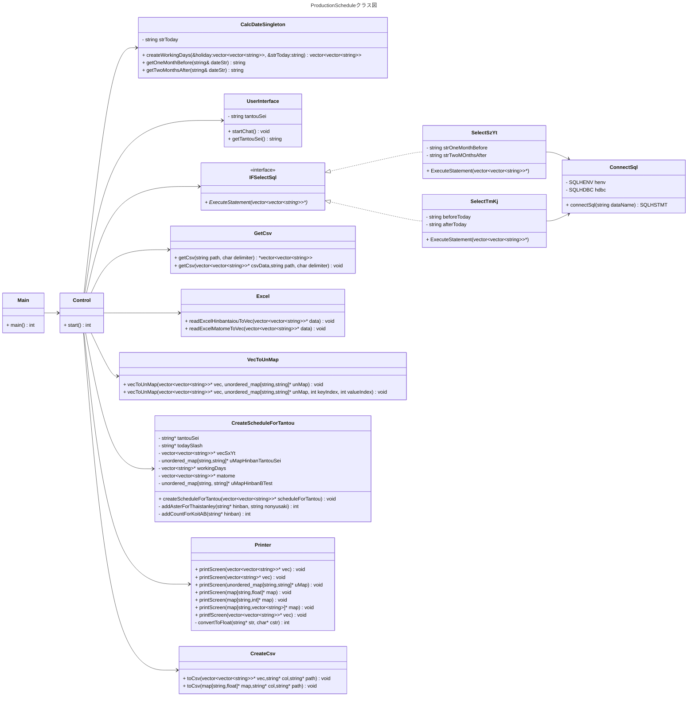
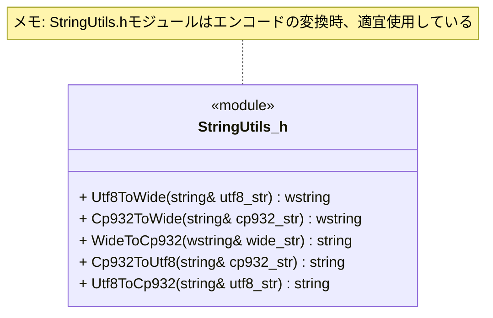

# ProductionSchedule.md - ProductionSchedule プロジェクト

## プロジェクト概要

本プロジェクトは、TSSシステムの生産予定から、検査担当者別の生産予定を表示するために設計されたC++プロジェクトです。アプリケーション名は「ProductionSchedule」で、Visual Studioを使用して構築されています。

主要な機能は以下の通りです：
1.  **データ取り込み（Data Ingestion）**: 複数のソースからデータを収集します。
    *   SQLデータベース（`ConnectSql.h`を介したODBCを使用）からスケジュールデータと休日情報を取得します。
    *   Excelファイル（`小糸B試験管理ｼｰﾄ.xlsx`）から製品情報（`hinbantaiou`）およびAB試験の記録データ（`matome`）を読み込みます。これには`OpenXLSX`ライブラリを使用しています。
    *   製品別の担当者を得る為に、検査日数情報を含むCSVファイル（`kensa_nissuu.csv`）を読み込みます。
2.  **ユーザー入力**: スケジュール担当者を示すID（`tantouSei`）をユーザーに要求します。
3.  **スケジュール生成**: 取り込まれたデータを処理・結合し、指定された担当者の製品の生産予定を抽出します。コアロジックは`CreateScheduleForTantou`クラスにカプセル化されています。
4.  **出力**:
    *   生成されたスケジュールをコンソールに表示します。
    *   スケジュールを`ProductionSchedule.csv`という名前のCSVファイルに保存します。
### 動作環境
Windows11
### 実装言語
C++
### ソースコード
GitHub ProductionScheduleリポジトリで公開
### 起動方法
productionSchedule.exeをダブルクリック
### 関連ファイル
- `192.168.1.247/技術課ﾌｫﾙﾀﾞ/ﾏｸﾛ/init/CommitSqlCpp_TSS_pass.txt`:SQLデータベース接続用ID,Pass
- `192.168.1.247/技術課ﾌｫﾙﾀﾞ/品質検査/小糸B試験管理ｼｰﾄ.xlsx`:Sheets("hinbantaiou"), Sheets("matome")を読み込む
- `192.168.1.247/技術課ﾌｫﾙﾀﾞ/200. effit_data/ﾏｽﾀ/kensa_nissuu.csv`:製品別の担当者を得る

## アーキテクチャ

プロジェクトはモジュール化されたオブジェクト指向設計に従っています：
*   `main.cpp`: `Control`オブジェクトを開始するエントリポイントです。
*   `Control.cpp`: 全体のプロセスを調整する中央コントローラーです。
*   `UserInterface`: ユーザーとのインタラクションを処理します。
*   `ConnectSql` / `IFSelectSql`: データベースインタラクションのためのレイヤーです。
*   `Excel`: Excelファイルからデータを読み込むためのクラスです。
*   `GetCsv`: CSVファイルからデータを読み込むためのクラスです。
*   `CreateScheduleForTantou`: 担当者別スケジュール作成のためのビジネスロジックを含むコアクラスです。
*   `Printer`: スケジュールを画面に表示するためのユーティリティです。
*   `CreateCsv`: スケジュールをCSVファイルに書き込むためのユーティリティです。
*   `CalcDateSingleton`: 日付計算を処理するためのシングルトンクラスです。
*   `VecToUnMap`: ベクターから順序なしマップにデータを変換するためのユーティリティです。
*   `StringUtils.h`:CP932, UTF-8, UTF-16の変換を行うためのユーティリティーです。

## ビルドと実行

*   **ビルド**: 本プロジェクトはVisual Studioプロジェクトです。ビルドするには、Visual Studioで`ProductionSchedule.sln`ファイルを開き、ソリューションをビルドしてください。出力は`x64/Debug`または`x64/Release`ディレクトリに配置されます。
*   **実行**: ビルド後、Visual Studio内から、またはビルド出力ディレクトリから直接`.exe`ファイルを実行することで、実行可能です。
*   **依存関係**: 本プロジェクトは`OpenXLSX`ライブラリに依存しています。`ReadExcel.cpp`のコメントによると、プロジェクトをビルドするためには適切にリンクする必要があります。**`ReadExcel.cpp`は本プロジェクトでは使われていません。**

## 開発規約

*   **コーディングスタイル**: コードは、クラスとヘッダーガードを備えた一貫したスタイルを使用しています。大規模なデータ構造を渡す際には、コピーを避けるためにポインターが使用されています。
*   **言語**: コードはC++で書かれています。コメントは日本語（おそらくShift-JIS）です。
*   **ファイルエンコード**: 全てのファイルエンコードは`CP932`です。Excelから読み込むデータは`UTF-8`ですが、内部では`CP932`に変換して処理しています。(`StringUtils.h`)
*   **テスト**: ディレクトリ構造には専用のテストファイルはありません。
*   **ビルドプロセス** Visual Studioプロジェクトで`OpenXLSX`ライブラリが正しく構成されていることに依存します。これを行うための正確な手順は、`ReadExcel.cpp`のコメント以外には、コード内に完全に文書化されていません。

